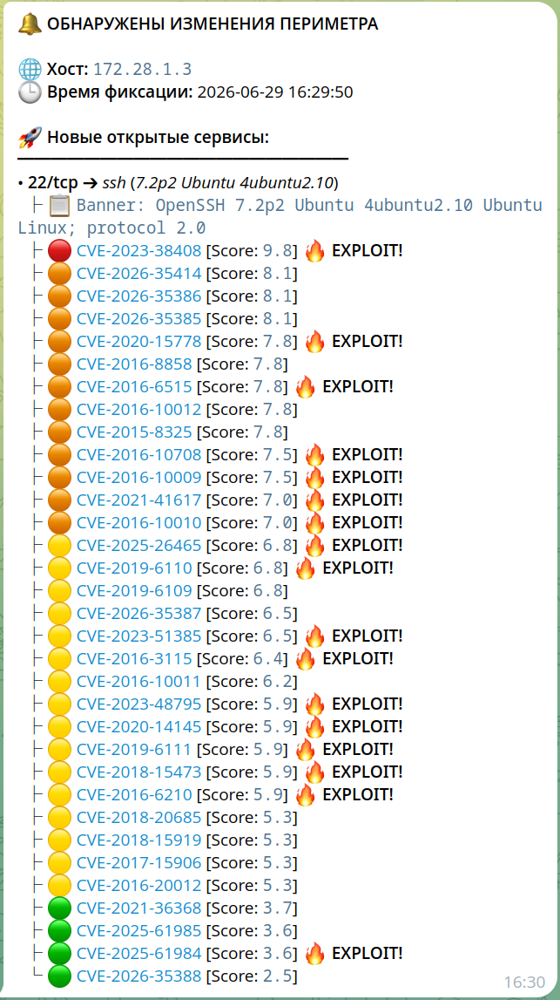

# Perimeter Security Scanner

## Description

A Clean Architecture-based Go application for automated network perimeter scanning, banner analysis, and vulnerability mapping. The system implements a two-stage scanning strategy: utilizing [**Masscan**](https://github.com/robertdavidgraham/masscan) for high-speed multi-threaded port discovery across large networks, and [**Nmap**](https://nmap.org/) for targeted service enrichment and banner analysis. Found CVEs are cross-referenced with the [**Vulners API**](https://vulners.com/) to check for public exploit availability. The application detects infrastructure drift against a database snapshot and dispatches real-time threat alerts.

## Architecture

The system operates as a unified multi-threaded pipeline. Below is the UML Activity Diagram illustrating the data flow from initial port discovery to vulnerability checking and state persistence:


### Core Components

- **Scanner Core** — Orchestrates Masscan for high-speed port discovery over target networks.
- **Enrichment Pipeline** — Multi-threaded workers that utilize Nmap to extract service banners and parse versions.
- **Exploit Intelligence** — Integrates with the Vulners API to detect public exploits (exploits are not searched for if the API key is missing).
- **Diff Analyzer** — Evaluates the perimeter delta against past states using configurable strategies (`immediate` or `aggregated`).
- **Storage Layer** — Persists database snapshot in PostgreSQL.
- **Notifier Module** — Dispatches structured alerts to target communication channel (Telegram).

## Alert Example

Below is an example of a consolidated real-time notification sent to Telegram when new services or exploitable vulnerabilities are exposed on the perimeter:



## Requirements

### For Deployment & Quick Start

If you run the application via Docker Compose, you only need:

- **Docker & Docker Compose**
- **Make** (optional, for convenience commands)

### For Local Development

If you prefer to build and run the binary natively on your host machine:

- **Go 1.25+**
- **PostgreSQL** (external or local database instance)
- **Masscan & Nmap**

## Quick Start

## Configuration

The application splits its configuration into environmental secrets (`.env`) and operational parameters (`config/config.yaml`).

Before running the application, you **must copy the example file and adjust them** for your environment.

### 1. Infrastructure & Secrets (`.env`)

Copy the template file to create your local environment file:

```bash
cp .env.example .env
```

Open .env and fill in your API tokens and database credentials (to run via Docker, you only need to specify `TELEGRAM_TOKEN`, `TELEGRAM_CHAT_ID`, and optionally `VULNERS_API_KEY`).

### 2. Scanner & App Settings (config/config.yaml)

Modify [config/config.yaml](./config/config.yaml) to adjust scanning intervals, targets, worker routines, and network interfaces.

## Run with Docker Compose

```bash
docker compose up --build
```

### Stop

```bash
docker compose stop

# or to stop and remove containers:

docker compose down
```

## Available Make Commands

```bash
make tools                # Install development tools (goimports, golangci-lint)
make fmtcheck             # Check formatting
make lint                 # Run golangci-lint
make test-unit            # Run unit tests
make test-integration     # Run integration tests with Docker environment
make test                 # Run all tests
```

## License

Distributed under the [MIT License](https://choosealicense.com/licenses/mit/). See [`LICENSE`](LICENSE) for more information.
